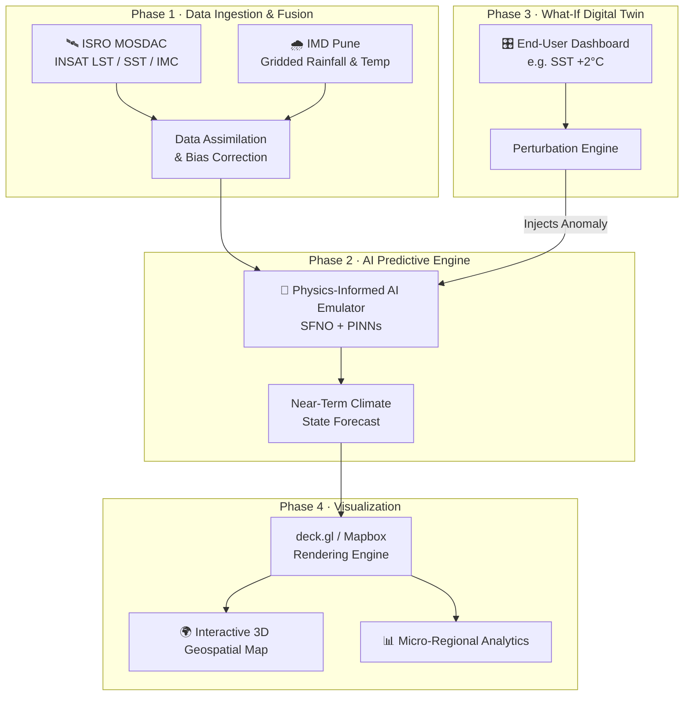

<div align="center">

# 🌍 Bharat Climate Twin
### *ISRO Prototype — Digital Twin*

**An AI-powered, India-specific Climate Digital Twin that doesn't just forecast the weather — it mirrors it, questions it, and lets you rewrite it.**

<br/>

🛰️ Built for **Bharatiya Antariksh Hackathon 2026** · ISRO × Hack2Skill
**Team Gen Z Coders**

[](https://isro-prototype-beta.vercel.app/)
[](https://github.com/Naathiq/ISRO-Prototype-)

[](#)
[](#)
[](#)
[](#)
[](#)
[](#-license)

</div>

<br/>

> ### 📡 Problem Statement
> **AI-Powered Digital Twin of India's Climate using India's National Data**
> Fusing ISRO's INSAT satellite telemetry with IMD's ground-truth observations into one continuously mirrored, physics-aware, interactively simulatable climate system.

<br/>

## 📖 Table of Contents

- [The Problem](#-the-problem-were-solving)
- [Our Innovation](#-our-innovation)
- [How We're Different](#-how-were-different)
- [Live Prototype — Current Features](#️-live-prototype--current-features)
- [Full System Architecture](#️-full-system-architecture-the-vision)
- [Tech Stack](#-tech-stack)
- [Getting Started](#-getting-started)
- [Project Structure](#-project-structure)
- [Roadmap](#️-roadmap)
- [Team](#-team--gen-z-coders)
- [Acknowledgements](#-acknowledgements)
- [License](#-license)

<br/>

## 🎯 The Problem We're Solving

India's climate data ecosystem is powerful — but fragmented, slow, and blind to uncertainty.

| Pain Point | Why It Hurts |
|---|---|
| 🗂️ **Siloed Data** | Highly accurate IMD ground observations and high-frequency ISRO INSAT (`3RIMG_L2B`) satellite data live in disconnected formats — no unified view |
| 🐢 **Slow & Static Models** | Traditional Numerical Weather Prediction (NWP) requires hours of computation just to output raw meteorological variables |
| ❓ **No "What-If" Analysis** | Conventional systems can't test hypothetical scenarios — "what if SST rises 2°C?" has no answer today |
| 📉 **Raw Values, No Context** | Decision-makers get `Rainfall = 25mm`, not what that *means* for floods, droughts, or crops |
| 🎲 **Blind to Uncertainty** | A single deterministic forecast, with no confidence range — especially dangerous during extreme weather |

<br/>

## 💡 Our Innovation

**Bharat Climate Twin** turns raw prediction into a living, queryable system:

| Problem | Our Solution |
|---|---|
| Siloed Data | **Unified Data Assimilation** — fuses IMD + ISRO INSAT into one continuous digital representation of India's climate, in real time |
| Slow & Static Models | **Real-Time AI Forecasting** — physics-informed AI predicts future climate states in seconds, not hours |
| No What-If Analysis | **Interactive Perturbation Engine** — nudge SST, humidity, or temperature and instantly watch the ripple effects |
| Raw Values, No Context | **Actionable Risk Intelligence** — converts numbers into Drought Risk, Flood Probability, Crop Water Stress, and Heatwave Alerts |
| Blind to Uncertainty | **Probabilistic Ensemble Forecasting** — parallel simulations yield confidence scores (e.g. *"78% probability of heavy rainfall"*) |

<br/>

## 🥇 How We're Different

*Existing weather systems only predict the future. We built something that mirrors it, questions it, and acts on it.*

| Feature | IMD Forecast | GraphCast | Pangu Weather | **Bharat Climate Twin** |
|---|:---:|:---:|:---:|:---:|
| Forecasting | ✅ | ✅ | ✅ | ✅ |
| India-Specific Data | ⚠️ Partial | ❌ | ❌ | ✅ |
| Digital Twin (Live Mirror) | ❌ | ❌ | ❌ | ✅ |
| What-If Simulation | ❌ | ❌ | ❌ | ✅ |
| Climate Risk Assessment | ❌ | ❌ | ❌ | ✅ |
| Policy Decision Support | ❌ | ❌ | ❌ | ✅ |
| Interactive Dashboard | ⚠️ Limited | ❌ | ❌ | ✅ |

<br/>

## 🖥️ Live Prototype — Current Features

The current build is an **interactive React + TypeScript prototype** that visualizes the digital twin concept as a fully navigable 3D globe.

**[▶️ Try the live prototype](https://isro-prototype-beta.vercel.app/)**

| Feature | Description |
|---|---|
| 🌐 **3D Earth Visualization** | Real-time interactive globe powered by `react-globe.gl` and `three.js` |
| 🛰️ **Simulated Satellite Constellation** | Animated orbital paths with live telemetry arcs across the globe |
| 🏭 **ISRO Mission Node Panels** | Facility-focused navigation across ISRO ground stations and mission nodes |
| 🗺️ **Multiple Data Layers** | Toggle between Satellite Radar, INSAT Climate Anomaly overlay, Jet/Current Stream visualization, and India-regional weather/heat/wind overlays |
| 🌓 **Day/Night Lighting Mode** | Dynamic terminator lighting with toggleable cloud rendering |
| ⏱️ **Time-Slider Playback** | Scrub through projected data behavior over time |
| ⚙️ **Settings Drawer** | Runtime controls for every visualization layer, live, with no reload |

<div align="center">

[](https://isro-prototype-beta.vercel.app/)

</div>

<br/>

## 🏗️ Full System Architecture (The Vision)

The live prototype is the **visualization shell**. Here's the full end-to-end pipeline it's designed to plug into:



**Pipeline in plain terms:**

1. **Data Ingestion** — Raw telemetry from INSAT satellites (LST, SST, IMC) and historical ground grids from IMD (rainfall, temperature) are continuously ingested.
2. **Data Fusion & Calibration** — An ML-driven assimilation pipeline uses IMD ground truth to bias-correct high-frequency INSAT satellite estimates.
3. **AI Emulation (the core)** — The unified atmospheric state is fed through Spherical Fourier Neural Operators (SFNOs) to rapidly predict the future climate state sequence.
4. **"What-If" Perturbation** — The end-user alters initial conditions on the dashboard; the perturbation engine instantly re-runs the AI emulator across the full atmospheric trajectory, in seconds.
5. **Visual Rendering** — Predictions stream to a React + deck.gl frontend, turning multidimensional tensors into interactive 3D cartographic heatmaps and analytics.

<br/>

### Core Capabilities of the Full System

| # | Capability | What It Delivers |
|---|---|---|
| 1 | 🔗 **Multi-Source Data Assimilation** | Continuous fusion of INSAT satellite + IMD ground observations into one unified climate state |
| 2 | 🎛️ **AI-Powered What-If Simulator** | Modify SST, temperature, or rainfall and instantly see recalculated heatwave risk, drought probability, and flood vulnerability |
| 3 | 📊 **Probabilistic Ensemble Forecast** | Multiple parallel simulations quantify uncertainty (e.g. `Heavy Rainfall Prob: 78%`, `Flood Risk: High`) |
| 4 | 🖥️ **GPU-Accelerated Dashboard** | Real-time climate maps, forecast animations, 3D weather visualization, layer-based exploration |
| 5 | 📍 **Micro-Regional Analytics** | Select any district, view rainfall/temp trends, generate localized climate risk reports |

<br/>

## 🧰 Tech Stack

### ✅ Current Prototype (Implemented)

<div align="center">

| Layer | Technology |
|---|---|
| **Framework** | React 19 + TypeScript |
| **Build Tool** | Vite 6 |
| **Styling** | Tailwind CSS 4 |
| **3D Globe** | Three.js + `react-globe.gl` |
| **Mapping** | Leaflet + `react-leaflet` |
| **Charts** | Recharts |
| **Motion** | Framer Motion (`motion`) |

</div>

### 🔭 Full Vision Stack (Planned / In Progress)

<div align="center">

| Layer | Technology |
|---|---|
| **AI & Deep Learning** | PyTorch / TensorFlow · SFNO (Spherical Fourier Neural Operators) · PINNs · DYffusion |
| **Geospatial Visualization** | React.js · Mapbox · deck.gl · WebGL2 / WebGPU |
| **Data Engineering** | Python · xarray · pandas · rasterio |
| **Data Sources** | ISRO MOSDAC · INSAT-3D / INSAT-3DR · IMD Weather Data · HDF5 & NetCDF |
| **Compute** | NVIDIA A100 GPUs · FastAPI perturbation endpoints |

</div>

<br/>

## 🚀 Getting Started

### 1. Install dependencies

```bash
npm install
```

### 2. Configure environment variables

```bash
cp .env.example .env
```

Set the required variables:

```
GEMINI_API_KEY=your_key_here
APP_URL=your_app_url_here
```

### 3. Run locally

```bash
npm run dev
```

By default, Vite serves the app at `http://0.0.0.0:3000`.

### Available Scripts

| Command | What It Does |
|---|---|
| `npm run dev` | Start the dev server |
| `npm run build` | Build the production bundle |
| `npm run preview` | Preview the production build locally |
| `npm run lint` | TypeScript type-check (`tsc --noEmit`) |
| `npm run clean` | Remove generated build artifacts |

> **Note:** The prototype relies on external map/texture tile endpoints for some globe and map assets. `script.ts` is a local utility used to patch sections of `DigitalTwin.tsx`.

<br/>

## 📁 Project Structure

```
src/
├── App.tsx                # App shell
├── main.tsx                # React entrypoint
├── index.css                # Global styles / theme
└── components/
    └── DigitalTwin.tsx        # Main digital twin UI + visualization logic
```

<br/>

## 🗺️ Roadmap

Turning the visualization shell into the full physics-aware Climate Digital Twin:

- [ ] 🔗 **Live Data Assimilation Pipeline** — real ingestion of ISRO MOSDAC (INSAT-3D/3DR) + IMD gridded observations via `xarray` / `rasterio`
- [ ] 🧠 **SFNO + PINNs Forecasting Core** — physics-informed emulator trained on fused historical + real-time climate state
- [ ] 🎛️ **FastAPI Perturbation Engine** — REST endpoint to inject "what-if" anomalies (e.g. `SST +2°C`) and trigger ensemble re-inference
- [ ] 📊 **Probabilistic Ensemble Forecasting** — Gaussian-noise ensemble generation for confidence-scored predictions
- [ ] 🌾 **Actionable Risk Layer** — auto-derive Drought Risk, Flood Probability, Crop Water Stress, and Heatwave Alerts from raw output
- [ ] 📍 **Micro-Regional Reports** — district-level time-series graphs, statistical summaries, and anomaly detection
- [ ] 🖥️ **GPU-Accelerated Rendering** — migrate globe rendering to deck.gl/WebGPU for 60-FPS, millions-of-points-capable visualization
- [ ] ☁️ **Cloud Compute Backend** — NVIDIA A100-backed training + inference infrastructure with large-scale tensor storage

<br/>

## 👥 Team — Gen Z Coders

| Role | Name | Institution |
|---|---|---|
| 🧑‍💻 **Team Leader** | Muhammad Naathiq N | Anna University Regional Campus, Tirunelveli |
| 👩‍💻 **Team Member** | Nivedhitha N | Rajalakshmi College of Engineering |
| 🧑‍💻 **Team Member** | Harrish Yesuraj P | Anna University Regional Campus, Tirunelveli |
| 🧑‍💻 **Team Member** | Narender R | Anna University Regional Campus, Tirunelveli |

<br/>

## 🙏 Acknowledgements

- **ISRO** — for INSAT satellite data access via MOSDAC
- **India Meteorological Department (IMD)** — for ground-truth observational data
- **Hack2Skill** — for organizing the Bharatiya Antariksh Hackathon 2026

<br/>

## 📄 License

Distributed under the **MIT License**.

<br/>

<div align="center">

### 🌍 A climate system you can question, not just read.

**[🚀 Live Demo](https://isro-prototype-beta.vercel.app/)** · **[💻 Source Code](https://github.com/Naathiq/ISRO-Prototype-)**

**If this project resonates with you, consider giving it a ⭐!**

</div>
